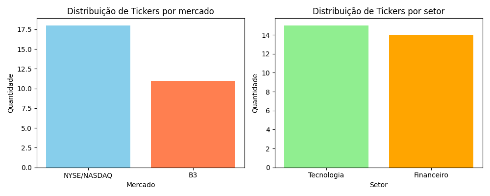
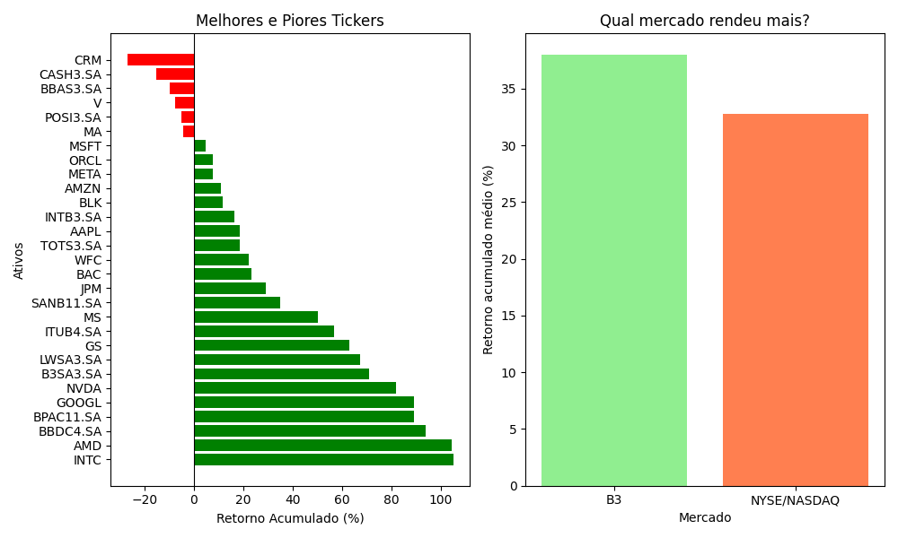
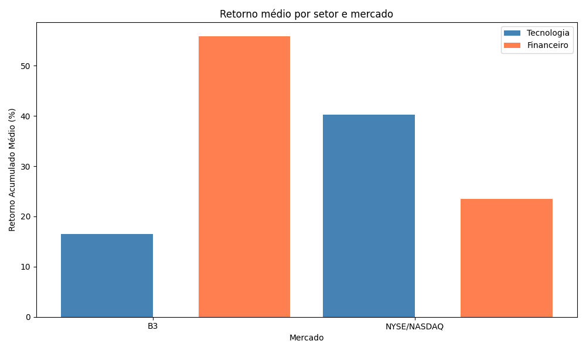
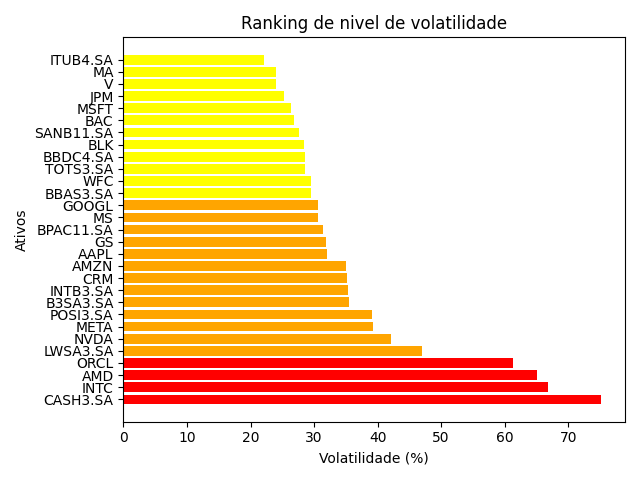
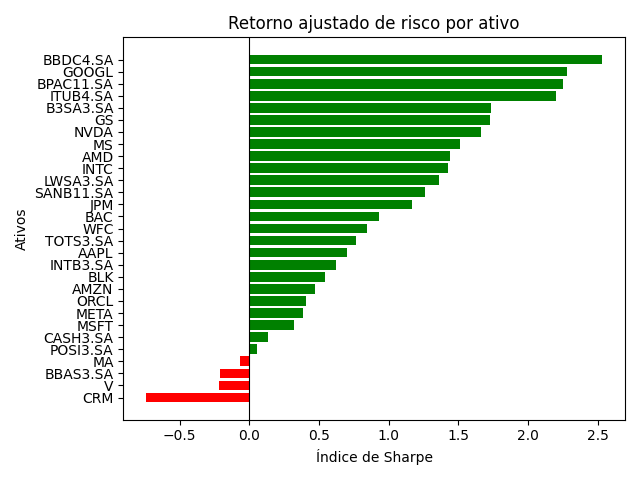
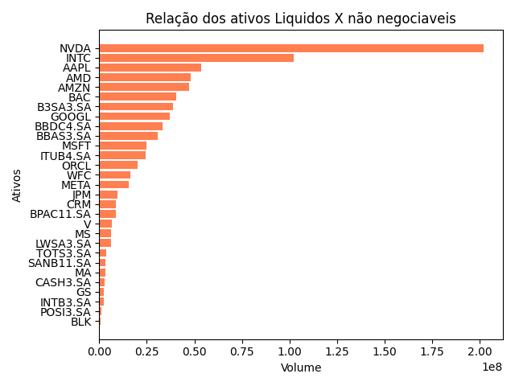
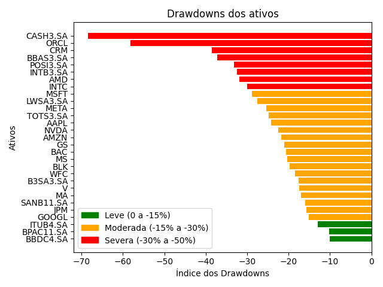
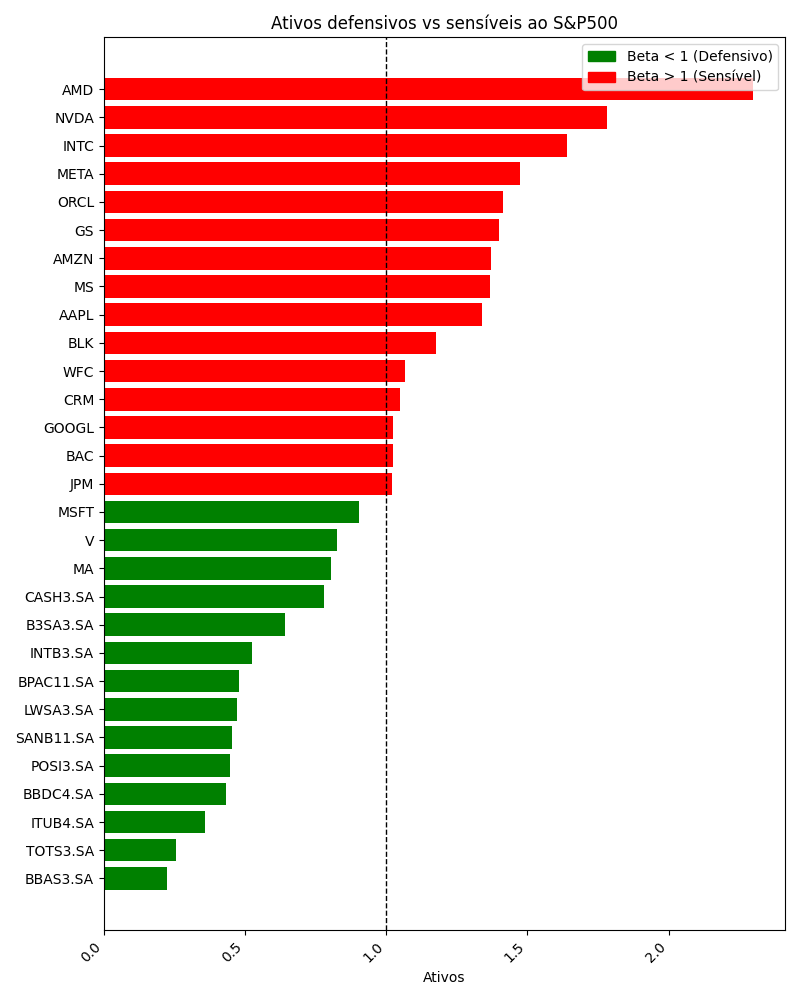
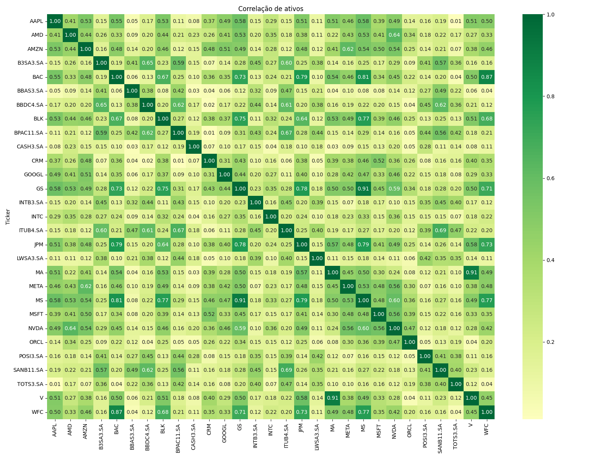

## FinScope – Painel de Análise de Ativos

Projeto de análise exploratória de ações brasileiras (B3) e americanas (NYSE/NASDAQ) com foco em retorno, risco e liquidez.

- **Linguagem**: Python  
- **Principais libs**: `pandas`, `numpy`, `yfinance`, `matplotlib`, `seaborn`  
- **Fonte de dados**: preços históricos via `yfinance` consolidados no CSV `CSV/acoes_analise.csv`

---

## Objetivo do projeto

- **Mapear** a distribuição dos ativos por setor e mercado.  
- **Avaliar** retornos acumulados e recentes.  
- **Comparar** desempenho de tecnologia x financeiro no Brasil e nos EUA.  
- **Mensurar** volatilidade, drawdown, risco (beta) e liquidez dos ativos.  
- **Explorar** correlação entre os ativos para apoiar decisões de diversificação.

---

## 1. Setores e mercados

Análise da distribuição dos ativos entre **B3** e **NYSE/NASDAQ** e entre os setores **Tecnologia** e **Financeiro**.

### Insights:
O dataset é composto por 29 ativos distribuídos entre NYSE/NASDAQ (18) e B3 (11), com leve predominância do mercado americano. Por setor, Tecnologia lidera com 15 ativos contra 14 do Financeiro — distribuição equilibrada que permite comparações justas entre os dois setores
---

## 2. Retornos

Análise dos retornos acumulados e médios por mercado, incluindo a comparação entre melhores e piores ativos.

### Insights
A B3 superou a NYSE em retorno médio acumulado no período — 37.96% contra 32.78%. Os destaques individuais foram INTC (105%) e AMD (104%), impulsionados pelo boom de semicondutores. No lado brasileiro, Bradesco (93%) e BTG Pactual (89%) lideraram. O pior desempenho foi da Salesforce com -27% de retorno acumulado.
---

## 3. Tech BR x Tech USA

Comparação do retorno acumulado médio entre ativos de **Tecnologia** e **Financeiro** em B3 e NYSE/NASDAQ.

### Insights
O setor Financeiro brasileiro liderou com retorno médio de 55.88%, impulsionado pela alta SELIC que favorece diretamente a rentabilidade dos bancos. Nos EUA, o setor de Tecnologia dominou com 40.25%, puxado por gigantes como NVIDIA e AMD. A maior diferença observada foi entre Tech BR (16.46%) e Tech USA (40.25%) — empresas tecnológicas brasileiras ainda são menos maduras e capitalizadas que suas concorrentes americanas, resultando em retornos significativamente menores. Conclusão: Brasil venceu no Financeiro, EUA venceu na Tecnologia.
---

## 4. Volatilidade e risco

Ranking dos ativos por nível de volatilidade anual, categorizando-os em diferentes faixas de risco.

### Insight
A volatilidade é uma forma de medir ou indicar a frenquencia das oscilações de preços, sabendo disso, o mercado que se destacou com essa volatilidade anual média, foi dos dois mercados, tanto brasileiro com 36.38% quanto estadunidense com 36.33%, ambos na faixa de alta volatilidade (30-50%), logo são os que mais oscilaram. Vendo o gráfico com os ativos, é notorio perceber que o ativo da Méliuz(CASH3.SA) esta com 75.17% de sua volatilidade,logo amostrando o pior cenário do investidor vendo seu patrimonio oscilar até 75% em um ano, um risco extremamente alto. E um dos mais estaveis foi do ITAU(ITUB4.SA) com 27% dentro da faixa moderada. O cruzamento mais relevante foi da TechBR concentrou a maior volatilidade do dataset com menor retorno - mais risco para menos resultado comparado à Tech americana
---

## 5. Classificação por risco (volatilidade)

Comparação dos ativos agrupados por faixas de risco / volatilidade.

---

## 6. Liquidez: ativos líquidos x menos negociados

Análise do volume médio diário negociado para identificar ativos mais líquidos e menos negociados.

---

## 7. Drawdown máximo

Análise da maior queda que cada ativo sofreu do pico até o ponto mais baixo (drawdown máximo).

---

## 8. Beta vs S&P500

Classificação dos ativos como **defensivos** (beta < 1) ou **sensíveis** (beta > 1) ao índice S&P500.

---

## 9. Correlação entre os ativos

Matriz de correlação entre os retornos dos ativos para avaliar relacionamentos e possíveis oportunidades de diversificação.

---

## insights:

